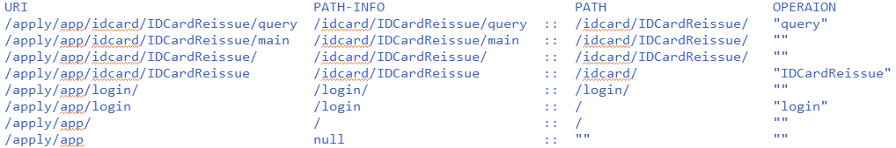

# 2.4.4 設定UDE權限驗證FILTER

when springSecurityOnly=false

## 定義 URI 如何對映到功能代碼

com.iisigroup.udeweb.security.springmvc.impl.DefaultOperationResolverImpl

annotation 定義模式

@Controller   
@ControllerService\(menuText = "A3. Check In with validation"\) @FunctionCode\("AW-SA0003"\)   
@RequestMapping\("/sample/checkIn2"\)  
「/app/sample/checkIn2  AW-SA0003」

## 定義如何由 IRole 取得對應功能權限清單

## 定義如何由 IRoles 取得對應功能選單結構

